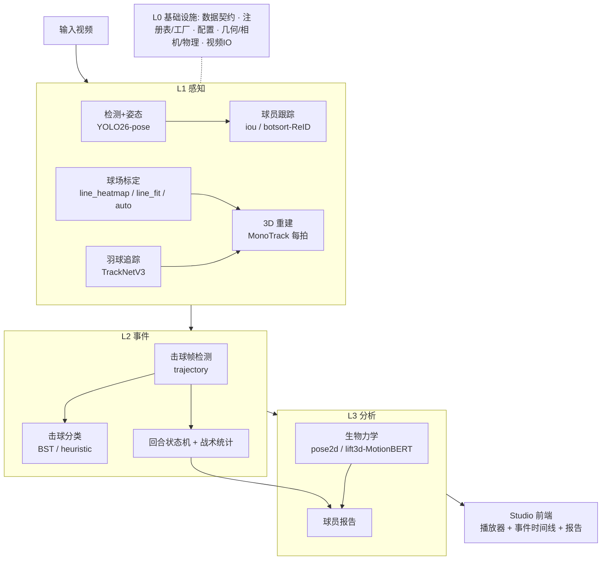

# 🏸 BadmintonCoach

> 模块化的羽毛球比赛视频分析系统 — 从单目视频提取球场、球员、羽球、击球与运动科学指标。

接口化、可插拔的多后端架构（注册表 + 工厂 + 冻结数据契约），每个环节都能按平台与性能预算
替换实现。在真实广播单打片段上端到端跑通：球场标定 → 球员检测/跟踪/姿态 → 羽球轨迹 → 每拍 3D →
击球分类 → 回合/战术统计 → 生物力学，并在剪辑器式前端可视化。


*(红线=球场, 黄=姿态骨架, 橙线=羽球 1s 轨迹, 球员旁=击球类型, 躯干线颜色=发力大小, 落点瞬时闪现)*

---

## 框架



**分层**：L0 基础设施 → L1 感知 → L2 事件 → L3 分析 → 可视化/应用。编排器只认接口，后端经
`@register("kind","name")` 自注册、`build("kind", cfg)` 实例化 — 整条链路按 YAML 配置组装。

---

## 安装

需 Python 3.11、[uv](https://github.com/astral-sh/uv)、NVIDIA GPU（CPU 亦可，较慢）。

```bash
git clone --recursive https://github.com/BMProjects/BadmintonCoach.git
cd BadmintonCoach
uv sync                                    # 安装依赖（pyproject + uv.lock）
git submodule update --init --recursive    # TrackNetV3 / MonoTrack / BST
```

**权重**（均不入库，见 `.gitignore`）：

| 权重 | 获取方式 |
|---|---|
| `yolo26n.pt` / `yolo26n-pose.pt` | Ultralytics 首次运行自动下载 |
| MotionBERT 3D ONNX (`weights/motionbert/`) | HuggingFace 自动下载 (`bukuroo/MotionBERT-3d-ONNX`) |
| OSNet ReID (botsort) | boxmot 首次运行自动下载 |
| `weights/ckpts/TrackNet_best.pt` | TrackNetV3 release |
| `weights/court_lines_evit_b1.pt` | `training/court_lines` 训练，或项目 release |

---

## 快速开始

```bash
# 剪辑器式前端：侧边栏设置 + 全宽播放器 + 多轨事件时间线(点击跳转) + 球员报告
uv run python -m apps.dev_console            # http://localhost:7860
```

```python
from badminton_coach.core.config import load_config
from badminton_coach.core.pipeline import Phase1Pipeline

cfg = load_config("configs/singles.yaml")
result = Phase1Pipeline.from_config(cfg).run("assets/sample_singles.mp4")
```

预设：`configs/singles.yaml`（默认 line_heatmap + iou）、`singles_auto.yaml`（球场择优）、
`singles_botsort.yaml`（ReID 跟踪，解决交叉换位）。

---

## 主要功能与参数

| 模块 | 后端 | 关键参数 |
|---|---|---|
| **球场标定** | `line_heatmap`(efficientvit_b1, 具名线热图+求交) / `line_fit`(几何) / `auto`(择优) | `decode`, `min_overlap`/`min_observed`(误检门控), `compute_camera` |
| **检测+姿态** | `yolo` + `yolo_pose`(YOLO26-pose) | `unified_perception`(一次前向出框+骨架), `threshold` |
| **球员跟踪** | `iou`(coasting+碎片合并) / `botsort`(OSNet ReID, 解决交叉) | `max_age_frames`, `merge_gap_frames`, `reid_weights` |
| **羽球追踪** | `tracknetv3` | `clip_window`(=seq_len) |
| **3D 重建** | `monotrack`(每拍弹道, 阻力模型) | 焦距由球场两正交灭点估计 |
| **击球/分类** | `trajectory` + `bst`(ShuttleSet 验证) / `heuristic` | hit-centred 时窗, `prior_correction` |
| **战术统计** | `rally` + `stats` | 回合/拍数, stroke 分布, 移动距离速度, 落点 |
| **生物力学** | `pose2d`(2D) / `lift3d`(MotionBERT 单目 3D) | `seq`(27/81/243), `PlayerProfile`(身高/体重/利手) |
| **3D 估计开关** | `perception.estimate_3d` | 关 → 纯 2D 快链路 (~2.7×) |
| **固定机位复用** | `perception.court_profile_path` | 整场只标一次 |

性能/边端部署见 [docs/PERFORMANCE.md](docs/PERFORMANCE.md)；模块状态见
[docs/MODULE_STATUS.md](docs/MODULE_STATUS.md)；生物力学调研见
[docs/RESEARCH_RACKET_BIOMECH.md](docs/RESEARCH_RACKET_BIOMECH.md)。

---

## 扩展新后端

1. 实现 `core/interfaces/` 中对应接口；2. 用 `@register("<kind>","<name>")` 装饰并在子包
`__init__` 导入；3. YAML 把该模块 `backend` 改为 `<name>`。无需改动其它代码。

---

## 诚实的边界

单目单视角广播 25fps：3D / 关节力矩为**相对/教练级**估计，非实验室绝对值；快肢（挥拍腕）最不准。
学习型球场标定仅在广播分布训练，对**业余低角度/大变形球场不泛化**（误检门控会拒绝而非画错）。

---

## 致谢（第三方项目）

本项目站在这些优秀开源工作之上：

- [Ultralytics YOLO](https://github.com/ultralytics/ultralytics) — 球员检测 + 姿态 (YOLO26-pose)
- [TrackNetV3](https://github.com/qaz812345/TrackNetV3) — 羽球轨迹追踪
- [MonoTrack](https://github.com/jhwang7628/monotrack) — 单目 3D 羽球重建（阻力物理模型）
- [BST](https://github.com/Va6lue/BST-Badminton-Stroke-type-Transformer) — 击球类型 Transformer；[ShuttleSet](https://github.com/wywyWang/CoachAI-Projects) 数据集
- [MotionBERT](https://github.com/Walter0807/MotionBERT) — 单目 3D 人体抬升（[ONNX 导出](https://huggingface.co/bukuroo/MotionBERT-3d-ONNX)）
- [boxmot](https://github.com/mikel-brostrom/boxmot) — BoT-SORT + OSNet ReID 跟踪
- [timm](https://github.com/huggingface/pytorch-image-models) — efficientvit 等骨干网络
- [PyTorch](https://pytorch.org) · [ONNX Runtime](https://onnxruntime.ai) · [OpenCV](https://opencv.org) · [NumPy](https://numpy.org) · [SciPy](https://scipy.org) · [Gradio](https://github.com/gradio-app/gradio) · [pydantic](https://github.com/pydantic/pydantic) · [imageio-ffmpeg](https://github.com/imageio/imageio-ffmpeg)
- 球场关键点数据：[BadmintonCourtDetectionOfficial](https://universe.roboflow.com/highlightsportbt/badmintoncourtdetectionoffical-b3hl9)（Roboflow, CC BY 4.0）
- 生物力学体段参数：de Leva (1996) / Winter, *Biomechanics and Motor Control of Human Movement*
