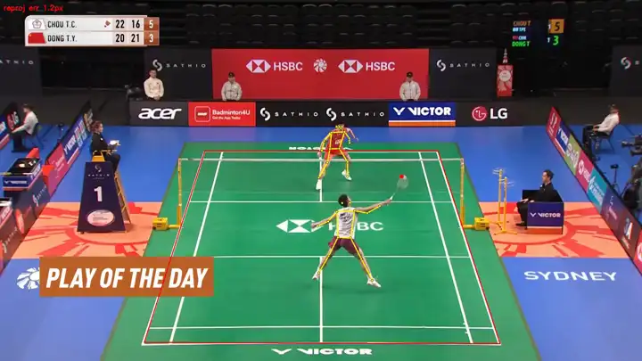

# 🏸 BadmintonCoach

> A modular badminton match-video analysis system — extracting court, players, shuttle,
> strokes, and sports-science metrics from monocular video.

A pluggable, interface-driven multi-backend architecture (registry + factory + frozen
data contracts): every stage can be swapped per platform and performance budget. Runs
end-to-end on real broadcast singles footage: court calibration → player
detection/tracking/pose → shuttle trajectory → per-shot 3D → stroke classification →
rally / tactical stats → biomechanics, visualized in a video-editor-style frontend.



*(red = court, yellow = pose skeleton, orange = shuttle 1s trajectory, label by player =
stroke type, trunk-line color = effort, landing point flashes momentarily)*

---

## Framework

```text
                              Input video
                                   │
  ┌────────────────────────────────▼─────────────────────────────────────┐
  │ L1  PERCEPTION                                                         │
  │   Detection + Pose (YOLO26-pose)  ──►  Player tracking (iou / botsort-ReID)
  │   Court calibration (line_heatmap / line_fit / auto) ─┐               │
  │   Shuttle tracking (TrackNetV3) ──────────────────────┴─► 3D recon    │
  │                                                          (MonoTrack)  │
  └────────────────────────────────┬─────────────────────────────────────┘
                                    ▼
  ┌──────────────────────────────────────────────────────────────────────┐
  │ L2  EVENTS                                                             │
  │   Hit detection (trajectory) ──►  Stroke classification (BST / heuristic)
  │                              └──►  Rally state machine + tactical stats │
  └────────────────────────────────┬─────────────────────────────────────┘
                                    ▼
  ┌──────────────────────────────────────────────────────────────────────┐
  │ L3  ANALYSIS                                                           │
  │   Biomechanics (pose2d / lift3d-MotionBERT)  ──►  Player report        │
  └────────────────────────────────┬─────────────────────────────────────┘
                                    ▼
              Studio frontend (player + event timeline + report)

  L0  INFRA: data contracts · registry/factory · config · geometry/camera/physics · video IO
```

**Layers**: L0 infrastructure → L1 perception → L2 events → L3 analysis → visualization /
app. The orchestrator knows only the interfaces; backends self-register via
`@register("kind","name")` and are instantiated by `build("kind", cfg)` — the whole
pipeline is assembled from YAML config.

---

## Installation

Requires Python 3.11, [uv](https://github.com/astral-sh/uv), an NVIDIA GPU (CPU works too,
slower).

```bash
git clone https://github.com/BMProjects/BadmintonCoach.git
cd BadmintonCoach
uv sync                                    # install deps (pyproject + uv.lock)

# Vendored dependencies are NOT tracked by this repo — clone them into third_party/:
git clone https://github.com/qaz812345/TrackNetV3                 third_party/TrackNetV3
git clone https://github.com/jhwang7628/monotrack                third_party/monotrack
git clone https://github.com/Va6lue/BST-Badminton-Stroke-type-Transformer third_party/BST
```

**Weights** (none committed — see `.gitignore`):

| Weight | How to obtain |
|---|---|
| `yolo26n.pt` / `yolo26n-pose.pt` | Auto-downloaded by Ultralytics on first run |
| MotionBERT 3D ONNX (`weights/motionbert/`) | Auto-downloaded from HuggingFace (`bukuroo/MotionBERT-3d-ONNX`) |
| OSNet ReID (botsort) | Auto-downloaded by boxmot on first run |
| `weights/ckpts/TrackNet_best.pt` | TrackNetV3 release |
| `weights/court_lines_evit_b1.pt` | Train via `training/court_lines`, or project release |

---

## Quick start

```bash
# Video-editor-style frontend: sidebar settings + full-width player +
# multi-track event timeline (click to seek) + player report
uv run python -m apps.dev_console            # http://localhost:7860
```

```python
from badminton_coach.core.config import load_config
from badminton_coach.core.pipeline import Phase1Pipeline

cfg = load_config("configs/singles.yaml")
result = Phase1Pipeline.from_config(cfg).run("assets/sample_singles.mp4")
```

Presets: `configs/singles.yaml` (default line_heatmap + iou), `singles_auto.yaml` (best-of
court calibration), `singles_botsort.yaml` (ReID tracking, resolves crossing ID-switches).

---

## Features & parameters

| Module | Backends | Key parameters |
|---|---|---|
| **Court calibration** | `line_heatmap` (efficientvit_b1, named line-heatmap + intersection) / `line_fit` (geometric) / `auto` (best-of) | `decode`, `min_overlap`/`min_observed` (false-positive gates), `compute_camera` |
| **Detection + pose** | `yolo` + `yolo_pose` (YOLO26-pose) | `unified_perception` (one forward → boxes + skeleton), `threshold` |
| **Player tracking** | `iou` (coasting + fragment merge) / `botsort` (OSNet ReID, resolves crossings) | `max_age_frames`, `merge_gap_frames`, `reid_weights` |
| **Shuttle tracking** | `tracknetv3` | `clip_window` (= seq_len) |
| **3D reconstruction** | `monotrack` (per-shot parabola, drag model) | focal from court vanishing points |
| **Hits / strokes** | `trajectory` + `bst` (ShuttleSet-validated) / `heuristic` | hit-centred window, `prior_correction` |
| **Tactical stats** | `rally` + `stats` | rallies/shots, stroke mix, movement distance & speed, landings |
| **Biomechanics** | `pose2d` (2D) / `lift3d` (MotionBERT monocular 3D) | `seq` (27/81/243), `PlayerProfile` (height/weight/handedness) |
| **3D toggle** | `perception.estimate_3d` | off → fast 2D-only pipeline (~2.7×) |
| **Fixed-camera reuse** | `perception.court_profile_path` | calibrate the whole match once |

Performance & edge deployment: [docs/PERFORMANCE.md](docs/PERFORMANCE.md); module status:
[docs/MODULE_STATUS.md](docs/MODULE_STATUS.md); biomechanics research:
[docs/RESEARCH_RACKET_BIOMECH.md](docs/RESEARCH_RACKET_BIOMECH.md).

---

## Adding a backend

1. Implement the matching interface in `core/interfaces/`; 2. decorate with
`@register("<kind>","<name>")` and import it in the subpackage `__init__`; 3. set that
module's `backend` to `<name>` in YAML. No other code changes needed.

---

## Honest limitations

Monocular single-view broadcast at 25 fps: 3D / joint loads are **relative / coaching-grade**
estimates, not lab-grade absolutes; fast limbs (the racket wrist) are least accurate. The
learned court calibrator is trained only on broadcast footage and does **not generalize to
amateur low-angle / heavily-distorted courts** (the false-positive gates reject rather than
mislabel).

---

## Acknowledgements

This project stands on these excellent open-source works:

- [Ultralytics YOLO](https://github.com/ultralytics/ultralytics) — player detection + pose (YOLO26-pose)
- [TrackNetV3](https://github.com/qaz812345/TrackNetV3) — shuttlecock trajectory tracking
- [MonoTrack](https://github.com/jhwang7628/monotrack) — monocular 3D shuttle reconstruction (drag physics)
- [BST](https://github.com/Va6lue/BST-Badminton-Stroke-type-Transformer) — stroke-type Transformer; [ShuttleSet](https://github.com/wywyWang/CoachAI-Projects) dataset
- [MotionBERT](https://github.com/Walter0807/MotionBERT) — monocular 3D human lifting ([ONNX export](https://huggingface.co/bukuroo/MotionBERT-3d-ONNX))
- [boxmot](https://github.com/mikel-brostrom/boxmot) — BoT-SORT + OSNet ReID tracking
- [timm](https://github.com/huggingface/pytorch-image-models) — backbones (efficientvit, etc.)
- [PyTorch](https://pytorch.org) · [ONNX Runtime](https://onnxruntime.ai) · [OpenCV](https://opencv.org) · [NumPy](https://numpy.org) · [SciPy](https://scipy.org) · [Gradio](https://github.com/gradio-app/gradio) · [pydantic](https://github.com/pydantic/pydantic) · [imageio-ffmpeg](https://github.com/imageio/imageio-ffmpeg)
- Court keypoint data: [BadmintonCourtDetectionOfficial](https://universe.roboflow.com/highlightsportbt/badmintoncourtdetectionoffical-b3hl9) (Roboflow, CC BY 4.0)
- Body-segment parameters: de Leva (1996) / Winter, *Biomechanics and Motor Control of Human Movement*
